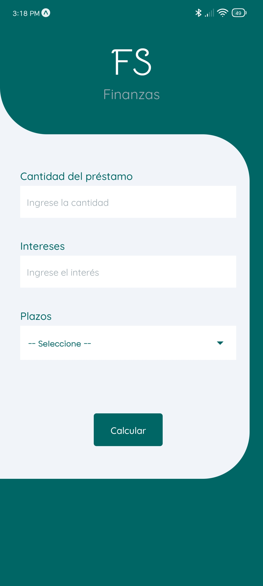

# FS Finanzas



## Proyecto con React Native - App de Prestamos

&nbsp;
&nbsp;

### 📱 App

✔️ Calcula un prestamo de acuerdo a la cantidad, intereses y plazos.

&nbsp;
&nbsp;

### Dependencias

-   [expo font](https://docs.expo.dev/versions/latest/sdk/font/)
-   [expo splash-screen](https://docs.expo.dev/versions/latest/sdk/splash-screen/)
-   [react-native-picker](https://github.com/react-native-picker/picker)

&nbsp;
&nbsp;

### Iniciar desarrollo

```
yarn start
```
